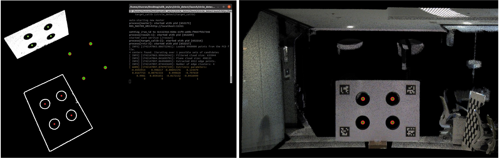
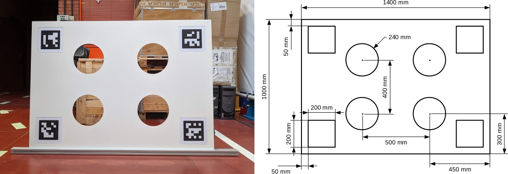
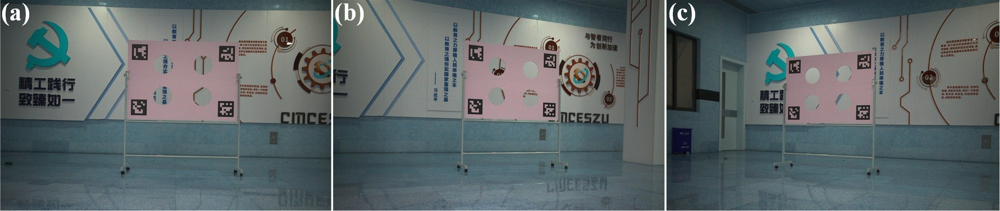

# FAST-Calib

## FAST-Calib: LiDAR-Camera Extrinsic Calibration in One Second

FAST-Calib is an efficient target-based extrinsic calibration tool for LiDAR-camera systems (eg., [FAST-LIVO2](https://github.com/hku-mars/FAST-LIVO2)). 

**Key highlights include:** 

1. Support solid-state and mechanical LiDAR.
2. No need for any initial extrinsic parameters.
3. Achieve highly accurate calibration results **in just one seconds**.

In short, it makes extrinsic calibration as simple as intrinsic calibration.

**Related paper:** 

[FAST-Calib: LiDAR-Camera Extrinsic Calibration in One Second](https://www.arxiv.org/pdf/2507.17210)

📬 For further assistance or inquiries, please feel free to contact Chunran Zheng at zhengcr@connect.hku.hk.

<p align="center">
  
  <font color=#a0a0a0 size=2>Left: Example of circle extraction from Mid360 point cloud | Right: Point cloud colored with calibrated extrinsic.</font>
</p>

## 1. Prerequisites
PCL>=1.8, OpenCV>=4.0.

## 2. Run our examples
1. Prepare the static acquisition data in the `calib_data` folder (see [Single-scene Calibration Sample Data](https://connecthkuhk-my.sharepoint.com/:f:/g/personal/zhengcr_connect_hku_hk/Eq_k_4Mf_11Eggg4a5lbRzgBHwd0EivtCJd2ExtcNlu1FA?e=vjm4gH) from Mid360, Avia and Ouster, and [Multi-scene Calibration Sample Data](https://pan.baidu.com/s/1Mkw7EWfiFT68LEzdkQnxeg?pwd=nyuh) from Avia):
- rosbag containing point cloud messages
- corresponding image

2. Run the single-scene calibration process:
```bash
roslaunch fast_calib calib.launch
```

3. After completing Step 2 for at least three different scenes, you can perform multi-scene joint calibration:
```bash
roslaunch fast_calib multi_calib.launch
```

## 3. Run on your own sensor suite
1. Customize the calibration target in the image below, with the CAD model available [here](https://pan.baidu.com/s/14Q2zmEfY6Z2O5Cq4wgVljQ?pwd=2hhn).
2. Collect data from three scenes, with placement illustrated below, and record them into the corresponding rosbags.
3. Provide the instrinsic matrix in `qr_params.yaml`.
4. Set distance filter in `qr_params.yaml` for board point cloud (extra points are acceptable).
5. Calibrate now!
<p align="center">
  
  <font color=#a0a0a0 size=2>Left: Actual calibration target | Right: Technical drawing with annotated dimensions.</font>
</p>
<p align="center">
  
  <font color=#a0a0a0 size=2>Placement of the calibration target for multi-scene data collection: (a) facing forward, (b) oriented to the right, (c) oriented to the left.</font>
</p>

## 4. Appendix
The calibration target design is based on the [velo2cam_calibration](https://github.com/beltransen/velo2cam_calibration).

For further details on the algorithm workflow, see [this document](https://github.com/xuankuzcr/FAST-Calib/blob/main/workflow.md).
## 5. Acknowledgments

Special thanks to [Jiaming Xu](https://github.com/Xujiaming1) for his support, [Haotian Li](https://github.com/luo-xue) for the equipment, and the [velo2cam_calibration](https://github.com/beltransen/velo2cam_calibration) algorithm.