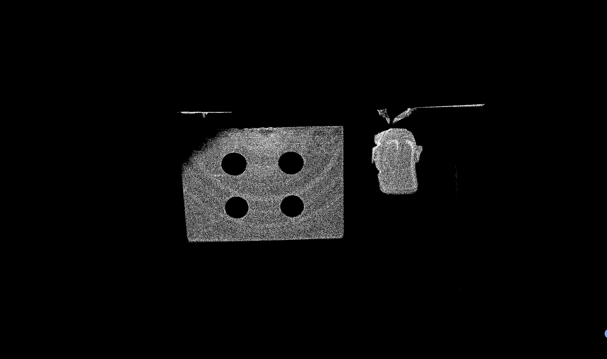
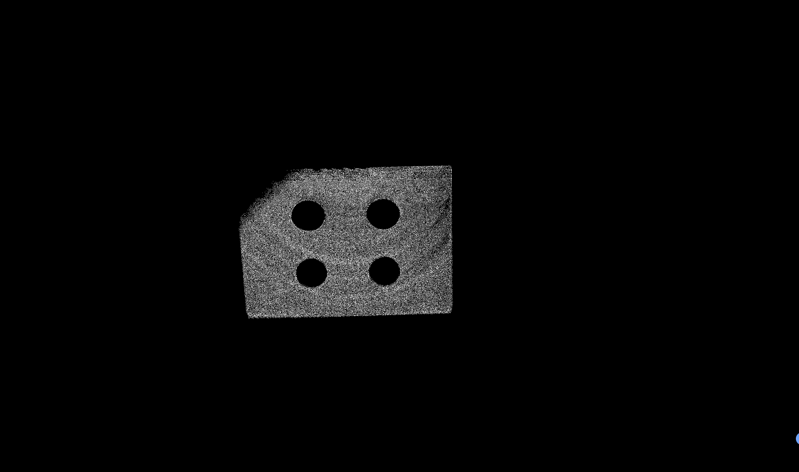
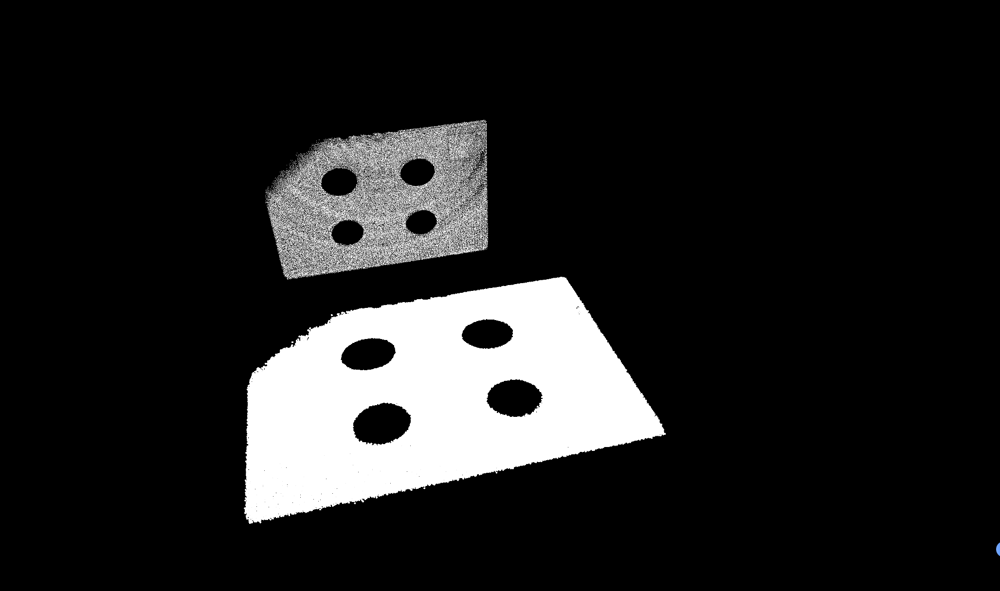
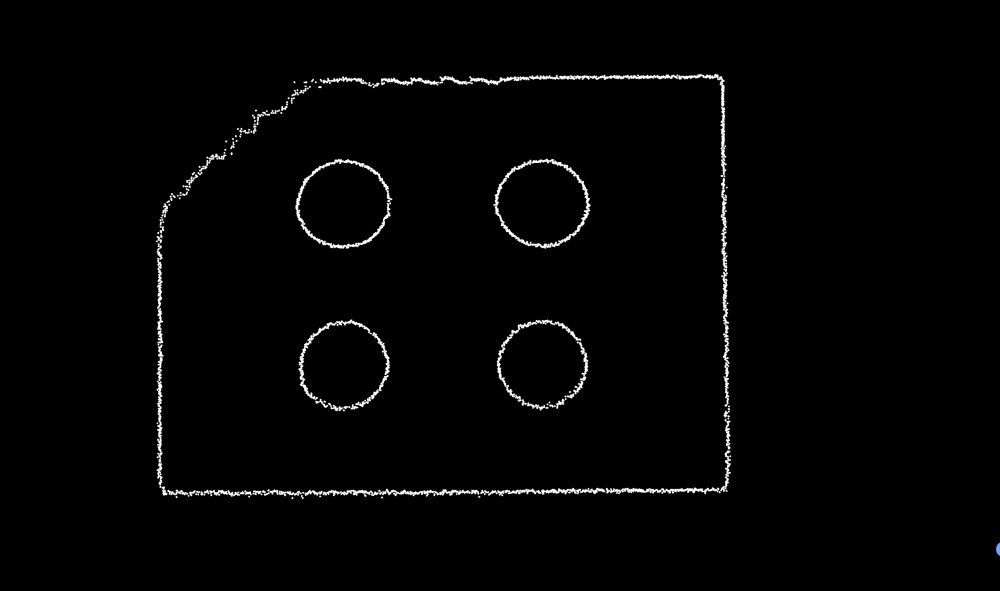
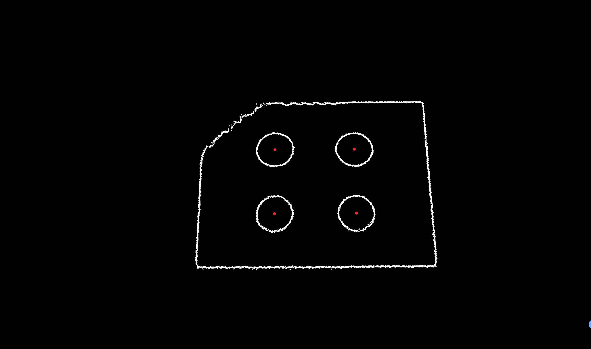
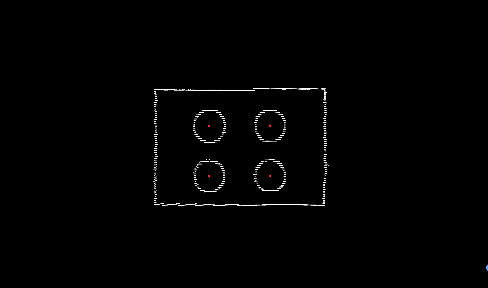
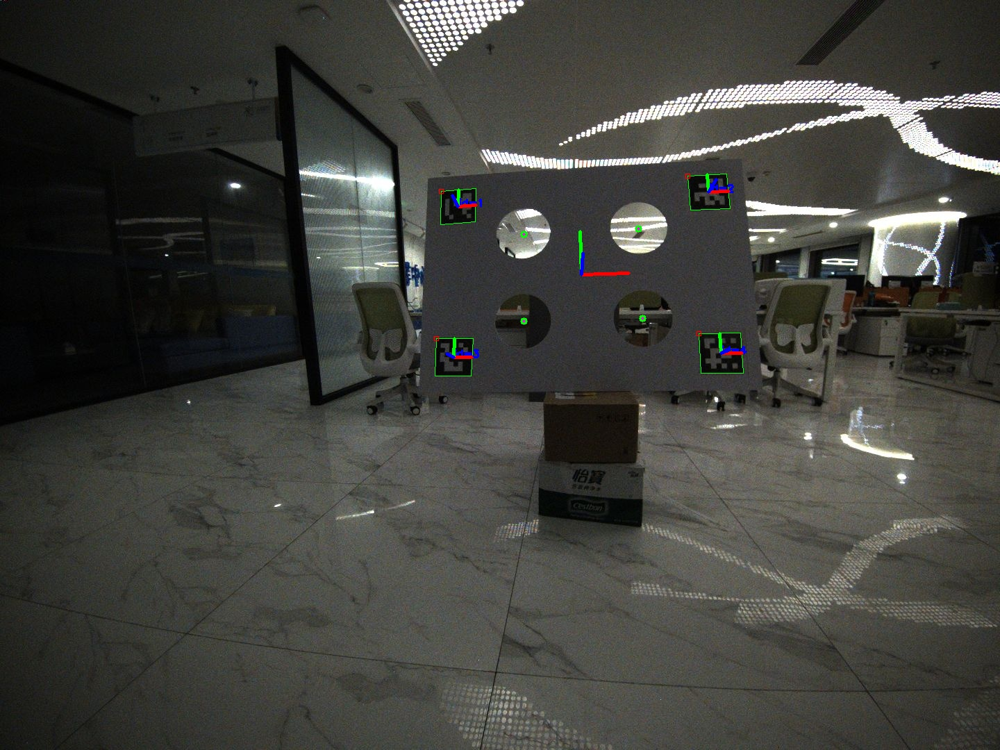

# Calibration Algorithm Workflow
## 1. Target-Based Extrinsic Calibration: Extracting Circle Centers Using Point Cloud
### 1.1 Distance Filtering
Filter the point cloud range in the X, Y, and Z directions to remove non-target points outside the FoV.

  

### 1.2 Plane Segmentation
Use the RANSAC algorithm to extract planes and retain the largest plane (with the most inliers).

  

### 1.3 Plane Alignment to 2D
Rotate the plane point cloud to align with the z=0 plane, forming a 2D point cloud for subsequent boundary point detection and circle fitting.

  

### 1.4 Boundary Point Detection
Detect boundary points in the 2D point cloud by calculating the polar coordinate angles of neighboring points within a 0.03m radius relative to the center point. Sort the angles in ascending or descending order, compute the differences between adjacent angles, and identify the largest angular gap. If the largest gap exceeds π/4, it is considered a boundary point.

  

### 1.5 Clustering and Circle Fitting
Perform Euclidean clustering on the boundary points and attempt 2D circle fitting for each cluster. Filter qualified circles based on fitting error and restore the circle center coordinates from the z=0 plane to the original coordinate system.

  

### 1.6 Extraction Performance of Mechanical LiDAR

  

## 2. Target-Based Extrinsic Calibration: Extracting Circle Centers Using ArUco Marker

  

